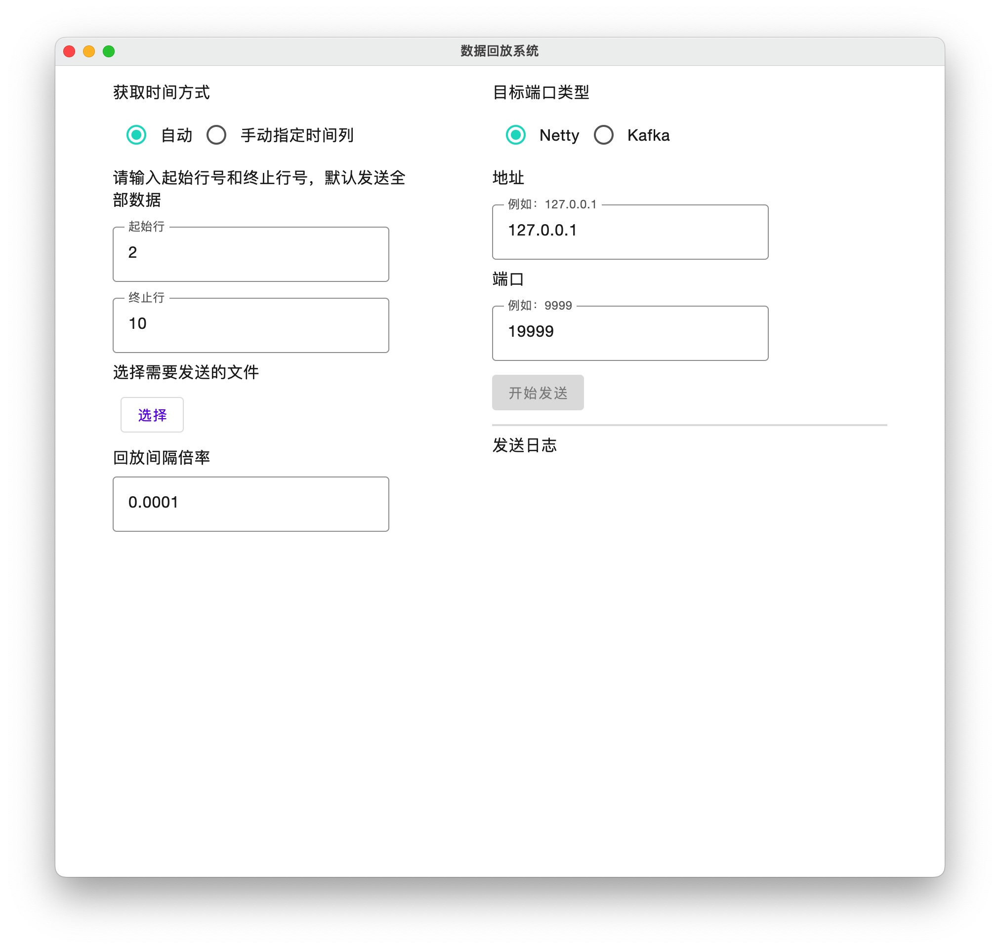
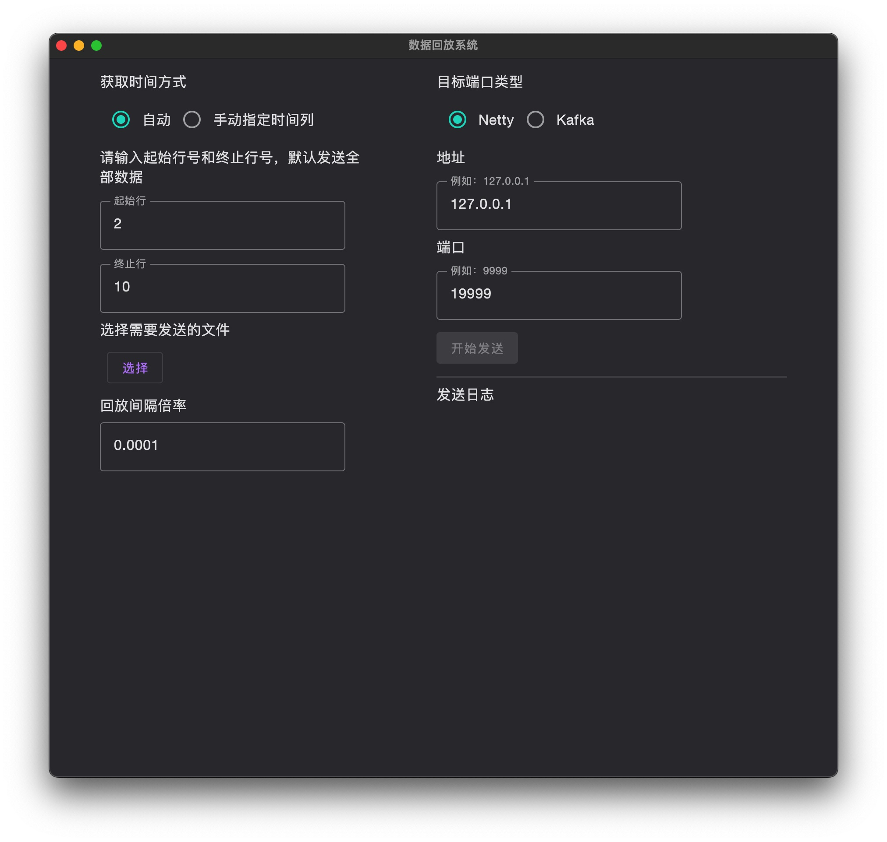

# 数据回放系统

## 需求分析

根据给定的数据文件，按照指定规则逐条发送到指定网络端口。

这里数据文件一般是csv格式，其中包括有时间字段，年月日时分秒或者是long数值型，数据记录按时间有序。

指定规则包括

（1）速度规则，如正常速度，1/2速度，2倍速，3倍速等。

比如两条记录间原来间隔2s，如果正常速度就是先发第一条记录，2s后发第二条记录，如果是1/2速度，则4s后发第二条记录，2倍速则1s后发第二条记录。

（2）时间规则，年月日时分秒 可 按规则替换。

比如第一条记录时间是2017-01-01 00:00:00，模拟2022年的数据，则第一条记录发送时时间需修改为2022-01-01 00:00:00
指定网络端口支持socket或kafka。

## 软件介绍

1. material design，使用 jetpack compose
2. 亮色深色模式自适配
3. 支持选择 csv，excel 文件
4. 支持目的端口 netty，kafka





## 测试代码

kafka consumer

```kotlin
import org.apache.kafka.clients.consumer.Consumer
import org.apache.kafka.clients.consumer.KafkaConsumer
import org.apache.kafka.common.serialization.StringDeserializer
import java.time.Duration
import java.util.*

private fun createConsumer(): Consumer<String, String> {
  val props = Properties()
  props["bootstrap.servers"] = "localhost:9092"
  props["group.id"] = "hello-world"
  props["key.deserializer"] = StringDeserializer::class.java
  props["value.deserializer"] = StringDeserializer::class.java
  return KafkaConsumer(props)
}

fun main() {
  val consumer = createConsumer()
  consumer.subscribe(listOf("Topic1"))

  while (true) {
    val records = consumer.poll(Duration.ofSeconds(1))
    println("Consumed ${records.count()} records")

    records.iterator().forEach {
      val message = it.value()
      println("Message: $message")
    }
  }
}
```

netty server

```kotlin
import io.netty.bootstrap.ServerBootstrap
import io.netty.buffer.ByteBuf
import io.netty.buffer.Unpooled
import io.netty.channel.*
import io.netty.channel.ChannelHandler.Sharable
import io.netty.channel.nio.NioEventLoopGroup
import io.netty.channel.socket.SocketChannel
import io.netty.channel.socket.nio.NioServerSocketChannel
import io.netty.util.CharsetUtil
import java.net.InetSocketAddress


class EchoServer(private val port: Int) {
  @Throws(Exception::class)
  fun start() {
    val serverHandler = EchoServerHandler()
    val group: EventLoopGroup = NioEventLoopGroup()
    try {
      val b = ServerBootstrap()
      b.group(group)
        .channel(NioServerSocketChannel::class.java)
        .localAddress(InetSocketAddress(port))
        .childHandler(object : ChannelInitializer<SocketChannel>() {
          @Throws(Exception::class)
          public override fun initChannel(ch: SocketChannel) {
            ch.pipeline().addLast(serverHandler)
          }
        })
      val f = b.bind().sync()
      println(
        EchoServer::class.java.name +
                " started and listening for connections on " + f.channel().localAddress()
      )
      f.channel().closeFuture().sync()
    } finally {
      group.shutdownGracefully().sync()
    }
  }

  companion object {
    @Throws(Exception::class)
    @JvmStatic
    fun main(args: Array<String>) {
      EchoServer(19999).start()
    }
  }
}


@Sharable
class EchoServerHandler : ChannelInboundHandlerAdapter() {
  override fun channelRead(ctx: ChannelHandlerContext, msg: Any) {
    val `in` = msg as ByteBuf
    println(
      "Server received: " + `in`.toString(CharsetUtil.UTF_8)
    )
    ctx.write(`in`)
  }

  @Throws(java.lang.Exception::class)
  override fun channelReadComplete(ctx: ChannelHandlerContext) {
    ctx.writeAndFlush(Unpooled.EMPTY_BUFFER)
      .addListener(ChannelFutureListener.CLOSE)
  }

  override fun exceptionCaught(
    ctx: ChannelHandlerContext,
    cause: Throwable,
  ) {
    cause.printStackTrace()
    ctx.close()
  }
}
```
